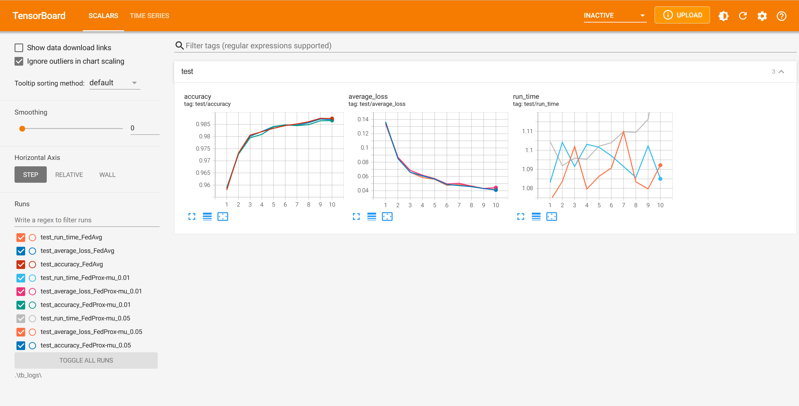

# 使用基准数据集和基准算法进行研究的一个示例

本节内容设计了一个研究示例，以展示如何通过使用 AlphaMed 平台的基准数据集和基准算法，分析研究不同算法之间的性能差异。

试验包括一个聚合方和两个数据持有方，使用 FedMNIST 基准数据集测试，两个参与方分别加载 FedMNIST 中一半的数据，但彼此之间不存在交集。试验分别使用 FedAvg 和 FedProx 基准算法，其中 FedProx 算法分别设置参数 mu = 0.01 和 0.05。为了比较一下三种基准算法设定下性能方面的差异，每一轮训练完成之后会执行一次测试，记录当前全局模型在测试集上的准确率，最终进行比较。

## 准备研究中共享的训练资源

由于研究目标是为了比较三种基准算法，因此训练时采用相同的模型、优化器和损失函数，采用同样的方式在节点间分配数据，定义同样的训练和测试流程。这些共享的代码资源可以定义在一个单独的文件中，方便不同的实验场景加载。本示例中统一存放在 [train_res.py](./train_res.py) 文件中。

### 定义模型、优化器、损失函数

本示例中通过定义 `get_conv_net`、`get_optimizer`、`get_loss_fn` 三个接口分别返回模型、优化器、损失函数的对象，每一个对象均是普通的 PyTorch 实例对象，并不需要为联邦环境做特殊的修改。出于简单演示的目的，学习率、动量参数、批次大小等参数采用固定值。

```Python
from typing import Callable, List, Tuple

import torch
import torch.nn.functional as F
import torchvision
from torch import Tensor, device, nn, optim
from torch.utils.data import DataLoader

from alphafed.dataset.mnist import FedMNIST

_LR = 0.01
_MOMENTUM = 0.9
_BATCH_SIZE = 128


class ConvNet(nn.Module):
    def __init__(self) -> None:
        super().__init__()
        self.conv1 = nn.Conv2d(in_channels=1, out_channels=10, kernel_size=5)
        self.conv2 = nn.Conv2d(in_channels=10, out_channels=20, kernel_size=5)
        self.conv2_drop = nn.Dropout2d()
        self.fc1 = nn.Linear(in_features=320, out_features=50)
        self.fc2 = nn.Linear(in_features=50, out_features=10)

    def forward(self, x):
        x = F.relu(F.max_pool2d(self.conv1(x), 2))
        x = F.relu(F.max_pool2d(self.conv2_drop(self.conv2(x)), 2))
        x = x.view(-1, 320)
        x = F.relu(self.fc1(x))
        x = F.dropout(x, training=self.training)
        x = self.fc2(x)
        return x


def get_conv_net() -> ConvNet:
    return ConvNet()


def get_optimizer(model: ConvNet) -> optim.Optimizer:
    return optim.SGD(model.parameters(), lr=_LR, momentum=_MOMENTUM)


def get_loss_fn() -> Callable:
    return F.cross_entropy
```

### 加载训练、测试数据

本示例中通过定义 `get_train_dataloader`、`get_test_dataloader` 两个接口分别返回训练和测试数据的 `DataLoader` 对象，数据源采用 FedMNIST 基准数据集。如果本地没有相关数据，会自动下载数据集放置于指定文件目录中。通过调用接口时传入不同的 `client_ids` 参数，可以控制加载 FedMNIST 中不同的子集划分，以模拟联邦环境中不同节点拥有不同数据的情况。

```Python
def get_train_dataloader(data_dir: str, client_ids: List[int]) -> DataLoader:
    return DataLoader(
        FedMNIST(
            data_dir,
            train=True,
            download=True,
            transform=torchvision.transforms.Compose([
                torchvision.transforms.ToTensor(),
                torchvision.transforms.Normalize((0.1307,), (0.3081,))
            ]),
            client_ids=client_ids
        ),
        batch_size=_BATCH_SIZE,
        shuffle=True,
        num_workers=4,
    )


def get_test_dataloader(data_dir: str, client_ids: List[int]) -> DataLoader:
    return DataLoader(
        FedMNIST(
            data_dir,
            train=False,
            download=True,
            transform=torchvision.transforms.Compose([
                torchvision.transforms.ToTensor(),
                torchvision.transforms.Normalize((0.1307,), (0.3081,))
            ]),
            client_ids=client_ids
        ),
        batch_size=_BATCH_SIZE,
        shuffle=False
    )
```

### 定义本地训练和测试过程

与本地训练模型时使用的训练、测试流程一致。

```Python
def train_an_epoch_process(model: ConvNet,
                           train_loader: DataLoader,
                           device: device,
                           optimizer: optim.Optimizer,
                           loss_fn: Callable) -> None:
    model.train()
    for data, labels in train_loader:
        data: Tensor
        labels: Tensor
        data, labels = data.to(device), labels.to(device)
        optimizer.zero_grad()
        output = model(data)
        loss: Tensor = loss_fn(output, labels)
        loss.backward()
        optimizer.step()


@torch.no_grad()
def test_process(model: ConvNet,
                 test_loader: DataLoader,
                 device: device,
                 loss_fn: Callable) -> Tuple[float, float]:
    model.eval()
    test_loss = 0
    correct = 0

    for data, labels in test_loader:
        data: Tensor
        labels: Tensor
        data, labels = data.to(device), labels.to(device)
        output: Tensor = model(data)
        test_loss += loss_fn(output, labels, reduction='sum').item()
        pred = output.max(1, keepdim=True)[1]
        correct += pred.eq(labels.view_as(pred)).sum().item()

    avg_loss = test_loss / len(test_loader.dataset)
    accuracy = correct / len(test_loader.dataset)

    return avg_loss, accuracy
```

至此，所有共享的训练代码资源定义完毕。

## 定义算法调度器

接下来需要定义 FedAvg 算法和 FedProx 算法的调度器实现，以用于实际执行联邦学习任务。

### 定义 FedAvg 算法调度器实现

由于 FedAvg 基准算法实现中已经提供了完整的联邦流程控制，因此只需要将训练中实际使用的模型、数据等资源对象传递给算法实现，并完整定义本地的训练和测试流程即可。

对于模型、优化器、损失函数、数据集等资源对象，可以从前面定义的 train_res.py 中直接获取。

```Python
from time import time
from typing import List

import torch
from torch import nn, optim
from torch.utils.data import DataLoader

from alphafed import get_dataset_dir, logger
from alphafed.fed_avg import FedAvgScheduler

from train_res import (get_conv_net, get_loss_fn, get_optimizer,
                       get_test_dataloader, get_train_dataloader,
                       test_process, train_an_epoch_process)


class BenchFedAvg(FedAvgScheduler):

    def __init__(self,
                 dataset_client_ids: List[int],
                 max_rounds: int = 0,
                 merge_epochs: int = 1,
                 calculation_timeout: int = 300,
                 log_rounds: int = 0,
                 involve_aggregator: bool = False) -> None:
        super().__init__(max_rounds=max_rounds,
                         merge_epochs=merge_epochs,
                         calculation_timeout=calculation_timeout,
                         log_rounds=log_rounds,
                         involve_aggregator=involve_aggregator)
        self.dataset_client_ids = dataset_client_ids
        self.device = torch.device('cuda' if torch.cuda.is_available() else 'cpu')
        self.seed = 42
        torch.manual_seed(self.seed)

    def build_model(self) -> nn.Module:
        model = get_conv_net()
        return model.to(self.device)

    def build_optimizer(self, model: nn.Module) -> optim.Optimizer:
        return get_optimizer(model=model)

    def build_train_dataloader(self) -> DataLoader:
        return get_train_dataloader(data_dir=get_dataset_dir(self.task_id),
                                    client_ids=self.dataset_client_ids)

    def build_test_dataloader(self) -> DataLoader:
        return get_test_dataloader(data_dir=get_dataset_dir(self.task_id),
                                   client_ids=self.dataset_client_ids)
```

算法调度器实现中的训练和测试流程，在 train_res.py 实现的基础上做了一些简单的扩展，主要是加入了一些新的日志信息，并且记录了测试的核心指标。

```Python
    def train_an_epoch(self) -> None:
        train_start = time()
        train_an_epoch_process(model=self.model,
                               train_loader=self.train_loader,
                               device=self.device,
                               optimizer=self.optimizer,
                               loss_fn=get_loss_fn())
        train_end = time()
        logger.info(f'完成一轮训练，耗时 {train_end - train_start:.3f} 秒')

    def run_test(self):
        test_start = time()
        avg_loss, accuracy = test_process(model=self.model,
                                          test_loader=self.test_loader,
                                          device=self.device,
                                          loss_fn=get_loss_fn())
        test_end = time()

        logger.info(f'Test set: Average loss: {avg_loss:.4f}')
        logger.info(f'Test set: Accuracy: {accuracy} ({accuracy * 100:.2f}%)')
        logger.info(f'完成一轮测试，耗时 {test_end - test_start:.3f} 秒')

        self.tb_writer.add_scalars('test/run_time', {'FedAvg': test_end - test_start}, self.current_round)
        self.tb_writer.add_scalars('test/average_loss', {'FedAvg': avg_loss}, self.current_round)
        self.tb_writer.add_scalars('test/accuracy', {'FedAvg': accuracy}, self.current_round)
```

至此，FedAvg 算法调度器实现完毕。完整代码保存在 [fed_avg_schd.py](./fed_avg_schd.py) 文件中。

### 定义 FedProx 算法调度器实现

FedProx 算法调度器实现与 FedAvg 基本一致，因为二者相似性很高，所以接口定义基本一致。区别主要是将基础类从 `FedAvgScheduler` 替换成了 `FedProxScheduler`。因此这里不再详细展示了，完整代码保存在 [fed_prox_schd.py](./fed_prox_schd.py) 文件中。

## 在模拟环境中运行任务

接下来可以在模拟环境中执行任务了，首先是定义模型环境运行的一些相关设置，加载相关依赖。

```Python
import logging

from fed_avg_schd import BenchFedAvg
from fed_prox_schd import BenchFedProx

from alphafed import logger, mock_context

logger.setLevel(logging.INFO)

# 算法实际运行时会从任务管理器获取任务参与节点的 Node ID 列表，但是在模拟环境不能通过
# 访问实际接口获得这个信息，所以需要通过 nodes 参数将这个列表配置在模拟环境中。
aggregator_id = 'b9003d53-1aba-4b1d-9af7-270367c68066'  # 设置一个假想 ID
col_id_1 = '6777d66c-08ac-4706-9548-5ad9087e61d6'  # 设置一个假想 ID
col_id_2 = 'fab71b71-46bd-4b12-b9df-c396d4e1daca'  # 设置一个假想 ID
```

然后分别为每个需要测试的算法配置好测试运行环境，以聚合方为例：

- 使用 FedAvg 完成一次训练，并记录相关评估结果

```Python
# 聚合方的模拟启动脚本
scheduler = BenchFedAvg(
    dataset_client_ids=list(range(1, 11)),
    max_rounds=10,
    log_rounds=1
)

task_id = 'd7e0c597-0acb-4b2f-aa3e-6ad6781095e5'  # 设置一个假想 ID
with mock_context(id=aggregator_id, nodes=[aggregator_id, col_id_1, col_id_2]):  # 在模拟调试环境中运行
    scheduler._run(id=aggregator_id, task_id=task_id, is_initiator=True)
```

- 使用 FedProx 完成一次训练，设置 mu 值为 0.01，并记录相关评估结果

```Python
scheduler = BenchFedProx(
    dataset_client_ids=list(range(1, 11)),
    max_rounds=10,
    mu=0.01,
    log_rounds=1
)

task_id = 'f12d8260-8df8-4a44-a4a4-335a68fd85d7'  # 设置一个假想 ID
with mock_context(id=aggregator_id, nodes=[aggregator_id, col_id_1, col_id_2]):
    scheduler._run(id=aggregator_id, task_id=task_id, is_initiator=True)
```

- 使用 FedProx 完成一次训练，设置 mu 值为 0.05，并记录相关评估结果

```Python
scheduler = BenchFedProx(
    dataset_client_ids=list(range(1, 11)),
    max_rounds=10,
    mu=0.05,
    log_rounds=1
)

task_id = 'f12d8260-8df8-4a44-a4a4-335a68fd85d7'  # 设置一个假想 ID
with mock_context(id=aggregator_id, nodes=[aggregator_id, col_id_1, col_id_2]):
    scheduler._run(id=aggregator_id, task_id=task_id, is_initiator=True)
```

其余两个数据持有方的模拟脚本与聚合方大同小异，只是具体参数根据节点角色略有调整，这里就不详细展示了。完整的代码记录在[聚合方脚本](./benchmark_aggregator.ipynb)、[数据持有方-1](./benchmark_collaborator_1.ipynb)、[数据持有方-2](./benchmark_collaborator_2.ipynb)文件中。

## 分析研究结果

三个计算任务全部运行完成之后，可以在模拟环境当前目录的 ./b9003d53-1aba-4b1d-9af7-270367c68066/tb_logs/ 文件夹下看到运行过程中保存的所有指标记录，均以 TensorBoard 日志的形式记录。将所有数据统一复制保存在本地的指定日志目录中，并通过 `tensorboard --logdir LOG-DIR` 命令启动 TensorBoard 服务，打开服务页面，就可以看到 TensorBoard 根据指标数据绘制的图表了。



通过图表数据可以发现，两种算法（三种配置）之间的性能差距极小，不足以表现出算法之间存在差异。这可能是因为示例中的任务过于简单导致的，你可以参考示例设计一个更有难度的任务试一试，也许会得到一些有价值的结论。
